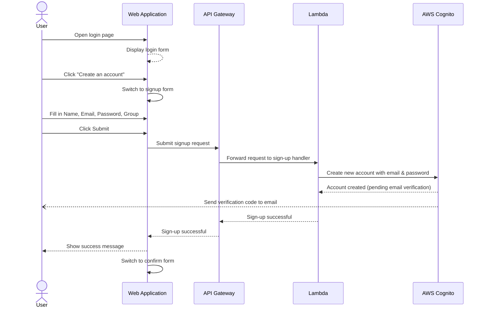
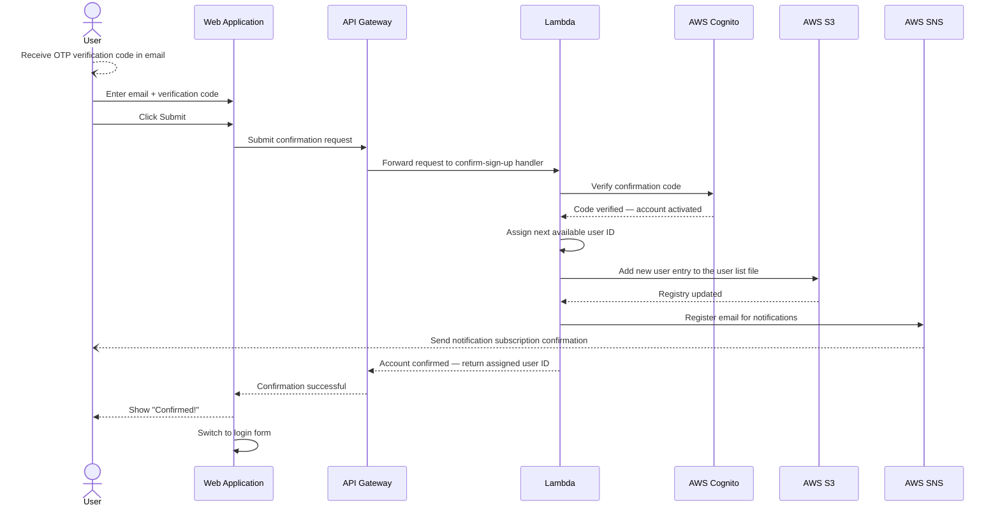
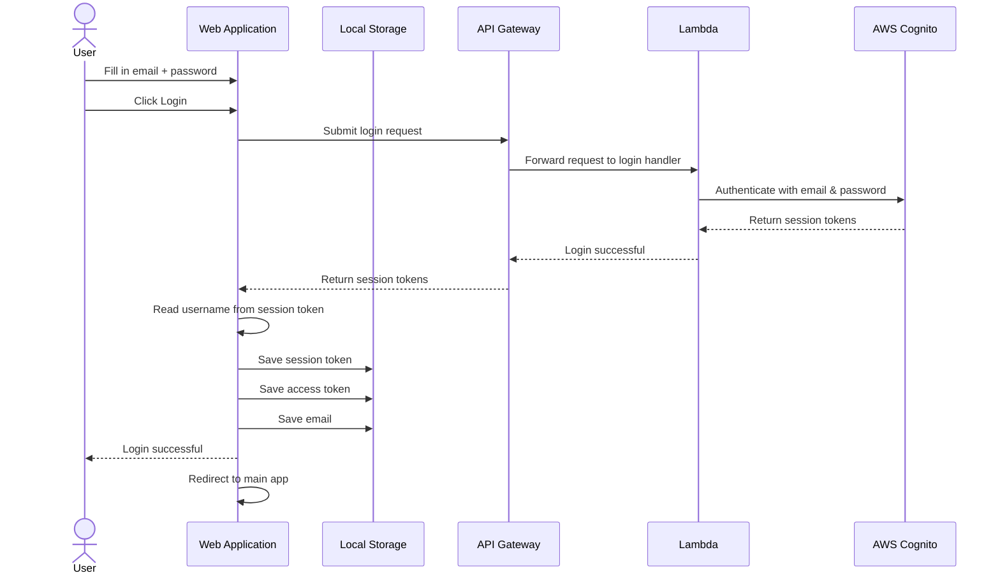
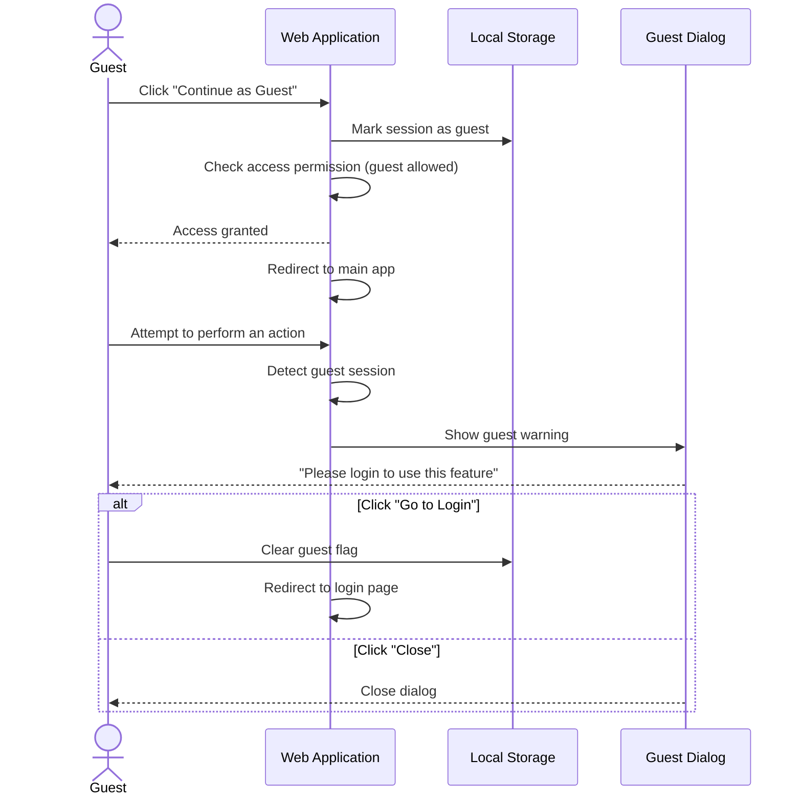
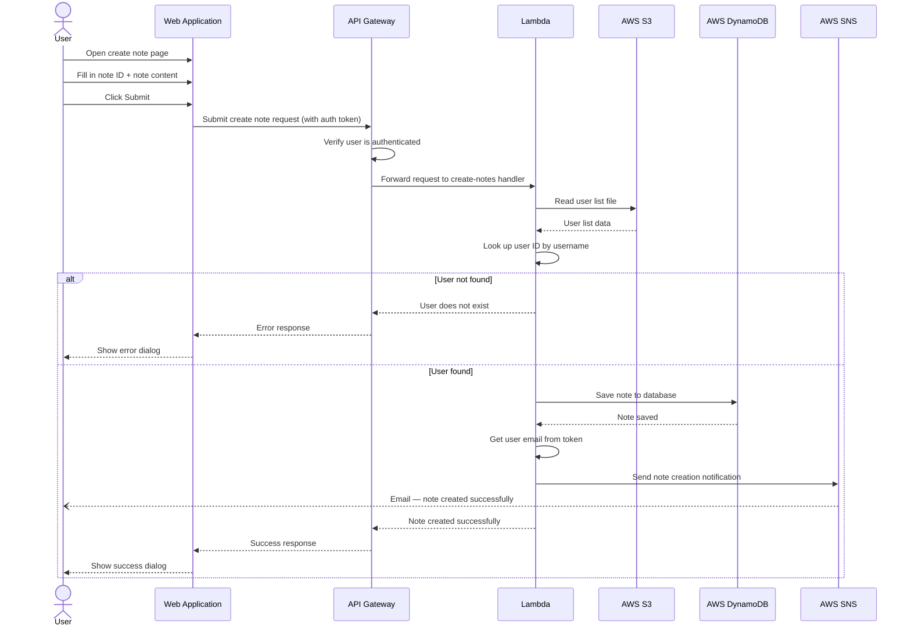
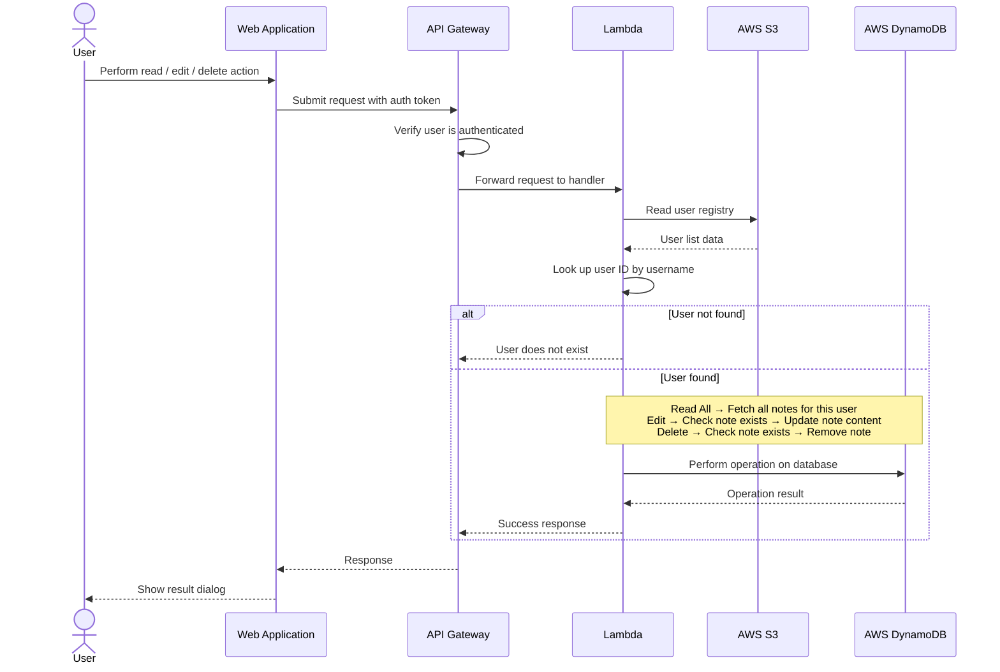
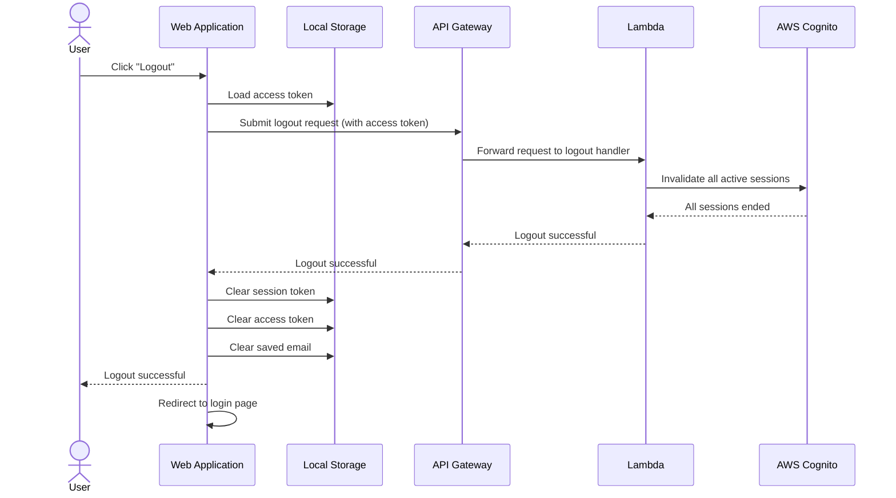

# Application Flow Documentation

## Overview

**Base API URL:** `https://d9tej631xf.execute-api.ap-southeast-7.amazonaws.com/prod/`

**Region:** `ap-southeast-7`

### API Endpoints Summary

| # | Action | Method | Endpoint | Auth Required | Request Body |
|---|--------|--------|----------|:---:|---|
| 1 | Sign Up | POST | `/auth/signup` | No | `{ name, email, password, group }` |
| 2 | Confirm Account | POST | `/auth/confirm` | No | `{ email, code }` |
| 3 | Login | POST | `/auth/login` | No | `{ email, password }` |
| 4 | Logout | POST | `/auth/logout` | Bearer accessToken | — |
| 5 | Create Note | POST | `/notes/create` | Bearer idToken | `{ name, noteId, noteMsg }` |
| 6 | Read All Notes | POST | `/notes/readAll` | Bearer idToken | `{ name }` |
| 7 | Edit Note | POST | `/notes/edit` | Bearer idToken | `{ name, noteId, noteMsg }` |
| 8 | Delete Note | POST | `/notes/delete` | Bearer idToken | `{ name, noteId }` |

---

## Case 1: Sign Up Flow

### API Details

| | |
|---|---|
| **Endpoint** | `POST /auth/signup` |
| **Lambda** | `sign-up` |
| **Auth** | None |
| **Request Body** | `{ email: string, password: string, name: string, group: string }` |
| **Success Response** | `200 { message: "Sign up successful. Please check your email for a verification code." }` |
| **Error Response** | `400 { message: "<Cognito error>" }` |

**Password policy:** min 8 characters, must contain uppercase, lowercase, and digits.

### Sequence Diagram



### Simple Flow

```
[Signup Form]
    │
    ├── Fill in Name / Email / Password / Group
    │
    ▼
POST /auth/signup → Lambda → Cognito SignUp
    │
    ├── Success ──► Show success message ──► Switch to Confirm form
    │                                        (Cognito sends OTP to email)
    └── Error ───► Show error message
```

---

## Case 2: Confirm Account Flow

### API Details

| | |
|---|---|
| **Endpoint** | `POST /auth/confirm` |
| **Lambda** | `confirm-sign-up` |
| **Auth** | None |
| **Request Body** | `{ email: string, code: string }` |
| **Success Response** | `200 { message: "Account confirmed successfully.", userId: <number> }` |
| **Error Response** | `400 { message: "<Cognito error>" }` |

**Side effects on success:**
- Assigns a sequential `userId` and appends the user to `userList.txt` in S3.
- Subscribes the user's email to the SNS topic for future notifications.

### Sequence Diagram



### Simple Flow

```
[Receive OTP from Email]
    │
    ▼
[Confirm Form] — Fill in Email + Code
    │
    ▼
POST /auth/confirm → Lambda
    │
    ├── Cognito: ConfirmSignUp (verify OTP)
    ├── Cognito: AdminGetUser (get name, group)
    ├── S3: Read userList.txt → calculate next userId
    ├── S3: Write userList.txt → append new user entry
    └── SNS: Subscribe user email to notification topic
    │
    ├── Success ──► Show "Confirmed!" ──► Switch to Login form
    └── Error ───► Show error message
```

---

## Case 3: Login Flow

### API Details

| | |
|---|---|
| **Endpoint** | `POST /auth/login` |
| **Lambda** | `login` |
| **Auth** | None |
| **Request Body** | `{ email: string, password: string }` |
| **Success Response** | `200 { accessToken, idToken, refreshToken }` |
| **Error Response** | `401 { message: "<Cognito error>" }` |

**Token usage:**
- `idToken` — sent as `Authorization` header for all protected `/notes/*` endpoints.
- `accessToken` — sent as `Authorization` header for logout only.
- `refreshToken` — stored for session refresh (not yet implemented in frontend).

### Sequence Diagram



### Simple Flow

```
[Login Form] — Fill in Email + Password
    │
    ▼
POST /auth/login → Lambda → Cognito InitiateAuth
    │
    ├── Success ──► Save idToken + accessToken to localStorage ──► Go to /create
    └── Error ───► Show error message
```

---

## Case 4: Guest Access Flow

### Sequence Diagram



### Simple Flow

```
[Login Page]
    │
    ├── Click "Continue as Guest"
    │
    ▼
sessionStorage['guest'] = 'true'
    │
    ▼
[Protected Pages] (accessible — but actions blocked)
    │
    ├── Attempt Create / Edit / Delete
    │       └──► GuestDialog ──► "Go to Login" or "Close"
    │
    └── Show All Notes
            └──► Skip data loading (no data displayed)
```

> Guest mode is frontend-only. No API calls are made for guests attempting note operations.

---

## Case 5: Note Operations (Authenticated Users)

### API Details — Create Note

| | |
|---|---|
| **Endpoint** | `POST /notes/create` |
| **Lambda** | `create-notes` |
| **Auth** | `Authorization: <idToken>` (Cognito Authorizer) |
| **Request Body** | `{ name: string, noteId: string, noteMsg: string }` |
| **Success Response** | `200 { message: "Note created successfully", userId, noteId }` |
| **Error Response** | `404 { message: "User '...' not found" }` |
| **Side effect** | Publishes SNS notification to the user's email |

### API Details — Read All Notes

| | |
|---|---|
| **Endpoint** | `POST /notes/readAll` |
| **Lambda** | `read-all-note` |
| **Auth** | `Authorization: <idToken>` (Cognito Authorizer) |
| **Request Body** | `{ name: string }` |
| **Success Response** | `200 { userId, notes: [ { userId, noteId, noteContent } ] }` |
| **Error Response** | `404 { message: "User '...' not found" }` |

### API Details — Edit Note

| | |
|---|---|
| **Endpoint** | `POST /notes/edit` |
| **Lambda** | `edit-note` |
| **Auth** | `Authorization: <idToken>` (Cognito Authorizer) |
| **Request Body** | `{ name: string, noteId: string, noteMsg: string }` |
| **Success Response** | `200 { message: "Note updated successfully", userId, noteId }` |
| **Error Response** | `404 { message: "User/Note not found" }` |

### API Details — Delete Note

| | |
|---|---|
| **Endpoint** | `POST /notes/delete` |
| **Lambda** | `delete-notes` |
| **Auth** | `Authorization: <idToken>` (Cognito Authorizer) |
| **Request Body** | `{ name: string, noteId: string }` |
| **Success Response** | `200 { message: "Note deleted successfully", noteId }` |
| **Error Response** | `400/404/500` with error message |

### Sequence Diagram — Create Note



### Sequence Diagram — Read / Edit / Delete Note



---

## Case 6: Logout Flow

### API Details

| | |
|---|---|
| **Endpoint** | `POST /auth/logout` |
| **Lambda** | `logout` |
| **Auth** | `Authorization: <accessToken>` (raw token, no "Bearer" prefix) |
| **Request Body** | None |
| **Success Response** | `200 { message: "Logged out successfully." }` |
| **Error Response** | `400 { message: "<Cognito error>" }` |

**Effect:** Calls Cognito `GlobalSignOut` — invalidates all tokens (access, id, refresh) across all sessions.

### Sequence Diagram



---

## Full Application Flow Overview



---

## Backend Architecture Summary

```
Client (Vue.js Frontend)
  └─► AWS API Gateway (REST API — note-api)
        │
        ├── /auth/* (no auth)
        │     ├── POST /signup   → Lambda: sign-up       → Cognito: SignUp
        │     ├── POST /confirm  → Lambda: confirm-sign-up→ Cognito + S3 + SNS
        │     ├── POST /login    → Lambda: login          → Cognito: InitiateAuth
        │     └── POST /logout   → Lambda: logout         → Cognito: GlobalSignOut
        │
        └── /notes/* (Cognito JWT Authorizer)
              ├── POST /create   → Lambda: create-notes  → S3 + DynamoDB + SNS
              ├── POST /readAll  → Lambda: read-all-note → S3 + DynamoDB
              ├── POST /edit     → Lambda: edit-note     → S3 + DynamoDB
              └── POST /delete   → Lambda: delete-notes  → S3 + DynamoDB

AWS Services:
  - Cognito User Pool  : User registration, verification, authentication
  - S3 (userList.txt)  : User registry — maps userId ↔ userName ↔ Group
  - DynamoDB           : Note storage (PK: userId, SK: noteId)
  - SNS                : Email notifications (account confirmed, note created)
```
